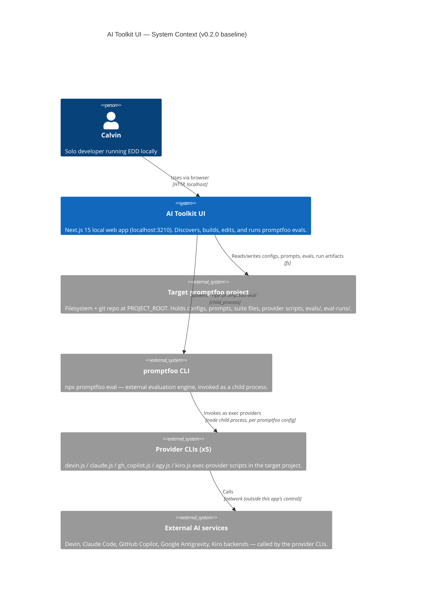
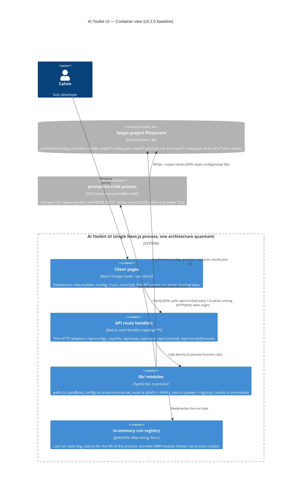

# AI Toolkit UI — Baseline Architecture

**Status:** Baseline (retroactive) — reflects shipped state as of **v0.2.0**
**Date:** 2026-07-10
**Type:** Brownfield baseline. This document records the architecture already in production use. It is not a proposal or redesign; where a decision has consequences that hurt, those consequences are recorded honestly rather than smoothed over. New architectural work should be proposed as ADR deltas against this baseline, not by editing history here.
**Source of truth:** `docs/prd.md` (FR-1..27, NFR-1..10, non-goals, OQ-1..5), and direct reading of `lib/paths.ts`, `lib/configs.ts`, `lib/evals.ts`, `lib/runs.ts`, `lib/results.ts`, `app/**`, `package.json`.

---

## 1. Driving architecture characteristics

Seven measurable characteristics, each traced to a PRD driver. These are the axes the *existing* design was (explicitly or implicitly) optimized against — not a wishlist.

| # | Characteristic | Measurable target | PRD trace |
|---|---|---|---|
| AC-1 | **Simplicity / minimal footprint** | Runtime dependency set stays at 4 packages (`next`, `react`, `react-dom`, `yaml`); no DB, no auth layer, no message broker | NFR-2 (no telemetry, no outbound calls of its own), Non-goals §7 (no multi-tenant hosting), A4 |
| AC-2 | **Data durability across process lifecycle** | 100% of run metadata survives a server restart (only live-log text of an in-flight run is lost, deterministically reclassified `failed`) | NFR-4, FR-20, FR-21, SM-4 |
| AC-3 | **Filesystem containment (security-in-depth for a trusted-but-fallible local user)** | 100% of `/api/file`, `/api/runs`, `/api/evals` path resolutions reject traversal outside `REPO_ROOT`, blocked segments, and non-allowlisted extensions | NFR-3, FR-8 |
| AC-4 | **No accidental cost-incurring side effects** | 0 code paths invoke `startRun`/`POST /api/runs` other than a direct user click | NFR-7, JTBD-4, SM-1's counter-metric |
| AC-5 | **Discovery scan cost bounded, independent of project size** | Scan depth capped at 2 from `REPO_ROOT`; scan time does not scale with `node_modules` size | NFR-8, FR-1 |
| AC-6 | **Editing safety (no silent data loss on the parts the UI touches directly)** | 0 unsaved-buffer writes; explicit round-trip fidelity boundary documented for builder-generated YAML | NFR-5, NFR-6 |
| AC-7 | **Result-rendering resilience to an external, versioned schema the app doesn't control** | Malformed/shifted `promptfoo --output` JSON degrades to a "no parseable results" message, never a crash | FR-22, FR-25, OQ-5 |

Implicit characteristics surfaced (not stated as FRs, but load-bearing):
- **Availability** is deliberately *not* a driver — this is a single-user dev tool run via `next dev`/`next start` on demand, not a service with an uptime SLA (Non-goals §7). No architecture spend went toward HA, and that is an accepted trade, not an oversight.
- **Security** is bounded, not absolute: NFR-1/NFR-3 protect against *accidental* path/URL bugs, not a malicious `PROJECT_ROOT` or hostile config content (A2). This is a conscious boundary, recorded in ADR-0005.

## 2. Architecture style in use

**Local-first monolithic web app — a "UI shell over a filesystem" with ad hoc process orchestration.**

Concretely: a single Next.js app-router process serves both the React client and the API route handlers (no separate backend service); all state of record lives as files in a target directory on disk that the app does not own (a separate git repo); "background work" (an eval run) is a spawned OS child process supervised by an in-memory map in the same Node process, mirrored to disk for durability. There is exactly one architecture quantum — the Next.js process — plus ephemeral, non-addressable child-process quanta that exist only for the lifetime of one `promptfoo eval` invocation and communicate back to the parent solely via stdout/stderr/exit-code and a results file, not any API.

This is not a layered enterprise app, not a service-based/microservices system, and not event-driven in the distributed-systems sense (there is no message broker; "events" are just Node `EventEmitter` callbacks on a child process within one OS process). It most resembles a **modular monolith with a pipeline of file transformations** (YAML in → form state → YAML out; config + prompt → child process → results JSON → normalized view model), fronted by a thin polling-based UI.

### Trade-off analysis

**What this rates well on, and why that's the right trade for this PRD:**
- *Simplicity/deployability* (AC-1): one `npm run dev`, no infra to stand up, no schema migrations, no auth to build/audit. For a single-user local tool this is close to free operational cost — the PRD's non-goals (no cloud hosting, no multi-tenant) mean the things a distributed style would buy (independent scaling, fault isolation between services, polyglot persistence) are all things nobody is asking for.
- *Data durability without a DB* (AC-2): git already versions the target project; piggybacking on it avoids running/backing up a database for a single user.
- *Change cost*: because there's one process and one deploy unit, there's no cross-service contract to version, no distributed transaction to reason about, no service mesh — the entire team (a team of one) can hold the whole system in their head.

**What this rates poorly on, and why it's accepted here:**
- *Elasticity/scalability*: does not scale beyond one user or one machine. Explicitly accepted — Non-goals §7 rules out multi-user and hosted deployment.
- *Fault isolation*: a crash in any `lib/` module (e.g. an unhandled exception parsing a hostile YAML file) takes down the whole app for the one user, including in-flight run tracking held in `globalThis`. Accepted because the blast radius is one person's dev session, not customers.
- *Concurrency/throughput governance*: nothing in the architecture limits how many child processes can run at once (Risk R-3 below) — this is a genuine architectural gap, not a deliberate simplicity trade, and is flagged as such rather than excused.
- *Testability/observability*: no test suite (NFR-10) and no structured logging/metrics — acceptable for a solo tool today, a real cost the moment more than one contributor touches this code (see Future Pressure Points).
- *Distributed-computing fallacies* are largely sidestepped, not because they were reasoned about, but because there is (almost) no distribution: the one place a network-like boundary exists is the child-process↔parent boundary and the client-poll↔server boundary, both same-machine, same-process-tree. The `npx promptfoo eval` shell-out is the one place "the network is reliable" / "latency is zero" fallacies could bite (e.g., a hung provider CLI has no timeout — see Risk R-3), which is the one seam most worth hardening if this ever grows.

## 3. Component & quantum boundaries

**Architecture quanta: 1 (deployable/runnable unit) + N ephemeral (non-addressable) child processes.**
- The Next.js process is the single quantum that owns independently-deployable behavior: it's the only thing with an API contract, the only thing addressed by the browser, the only thing that persists between requests (via `globalThis` and the filesystem).
- Each `promptfoo eval` child process is *not* a quantum in the architectural sense — it has no independent deployability, no API of its own, and is entirely owned/supervised by `lib/runs.ts`. It's better modeled as a **pipe-and-filter stage** invoked synchronously-in-spirit (async in wall-clock) by the quantum.
- The "target project" filesystem and the 5 provider-CLI scripts are **external systems** the quantum depends on but does not own or version.

No bounded-context split was made beneath the single quantum — the domain (discover / build / edit / run / view-results) is small enough that `lib/{paths,configs,evals,runs,results}.ts` function as informal modules within one context, not separate services. This is intentional: splitting a single-user, single-process tool into services would add distribution-tax (network calls, serialization, partial failure) for zero scaling or team-boundary benefit, which is precisely the "distributed monolith" anti-pattern Richards & Ford warn against when the drivers don't call for it.

## 4. C4 diagrams

### 4.1 System Context

### 4.2 Container

## 5. Component / module map

| Module / route group | Single responsibility | Depends on |
|---|---|---|
| `lib/paths.ts` | Resolve `REPO_ROOT` from `PROJECT_ROOT`; sandbox path resolution (`resolveRepoPath`) — traversal, blocked segments, extension allowlist | Node `path`, `process.env` |
| `lib/configs.ts` | Bounded-depth YAML scan of `REPO_ROOT`; classify a YAML file as a "config" (has `prompts` + `tests`); summarize providers/grader/tests/suite files for the dashboard | `lib/paths.ts` (REPO_ROOT), `lib/evals.ts` (GENERATED_MARKER), `yaml`, `fs` |
| `lib/evals.ts` | Builder draft model; fixed 5-runner catalog; `EvalDraft` ↔ config-YAML + prompt-markdown serialization; validation; marker-stamped generated-config detection | `lib/paths.ts` (REPO_ROOT), `yaml`, `fs` |
| `lib/runs.ts` | Spawn `npx promptfoo eval` child processes; own the `globalThis` run registry; persist `meta.json` on every state transition; log capping; restart-recovery reclassification | `lib/paths.ts` (REPO_ROOT, RUNS_DIR, resolveRepoPath), Node `child_process`, `fs` |
| `lib/results.ts` | Defensive normalization of promptfoo's `--output` JSON into a stable UI view model, tolerant of at least two known result-array shapes | `fs` only (no dependency on other `lib/` modules) |
| `app/api/configs/route.ts` | HTTP adapter: `GET` → `listConfigs()` | `lib/configs.ts` |
| `app/api/file/route.ts` | HTTP adapter: `GET`/`PUT` raw file read/write through the sandbox | `lib/paths.ts` |
| `app/api/evals/route.ts` | HTTP adapter: `GET` runner catalog / draft-for-edit, `POST` create, `PUT` update; enforces create-vs-update existence rules | `lib/evals.ts`, `lib/paths.ts` |
| `app/api/runs/route.ts` | HTTP adapter: `GET` run list, `POST` start a run | `lib/runs.ts` |
| `app/api/runs/[id]/route.ts` | HTTP adapter: `GET` single run status/log (strips `outputFile` from response) | `lib/runs.ts` |
| `app/api/runs/[id]/results/route.ts` | HTTP adapter: `GET` normalized results for a completed run | `lib/runs.ts`, `lib/results.ts` |
| `app/page.tsx` (dashboard) | List configs + recent 8 runs; entry point to build/edit/run | `/api/configs`, `/api/runs`, `RunButton`, `StatusBadge` |
| `app/new/page.tsx` (builder) | Form-driven eval creation/edit (`EvalDraft`) | `/api/evals`, `/api/runs` |
| `app/config/page.tsx` | Overview + raw-tab editing of an existing config | `/api/configs`, `/api/file`, `FileEditor` |
| `app/runs/page.tsx` | Full run history table | `/api/runs` |
| `app/runs/[id]/page.tsx` | Poll run status (1.5s) + render live log and, on completion, normalized results | `/api/runs/[id]`, `/api/runs/[id]/results` |
| `app/components/FileEditor.tsx` | Plain-textarea editor with explicit dirty/save state | `/api/file` |
| `app/components/RunButton.tsx`, `StatusBadge.tsx` | Presentational/interaction primitives, no independent responsibility beyond their host page | `/api/runs` (RunButton only) |

## 6. Data & state model — "the filesystem is the database"

There is no database. Every artifact type has exactly one location, and that location is inside the **target project**, not the app's own repo:

| Artifact | Location | Written by | Consistency notes |
|---|---|---|---|
| Eval config YAML | `<anywhere ≤2 dirs deep under REPO_ROOT>/*.yaml` (builder output specifically under `evals/<slug>.config.yaml`) | Hand-edit (any config) or `POST/PUT /api/evals` (generated only) | Source of truth for dashboard summaries — never cached; re-read on every `GET /api/configs` |
| Prompt markdown | `evals/<slug>.prompt.md` (builder) or wherever a hand-written config's `prompts: file://` points | Hand-edit or builder | Referenced by relative path from the config; broken references degrade to an empty prompt in `filesToDraft`, not an error |
| Suite files (`tests: file://`) | Wherever referenced | Hand-edit only (builder doesn't author these) | Expanded/inlined at scan time in `collectTests`; a broken suite file yields a placeholder test row, not a scan failure |
| Run metadata | `eval-runs/<id>.meta.json` | `lib/runs.ts` `persistMeta()`, on every state transition | Durable, small, JSON — this *is* the durability mechanism for AC-2/NFR-4 |
| Run results | `eval-runs/<id>.json` | The spawned `promptfoo eval --output` process itself, not the UI | UI never writes this file; only reads/normalizes it |
| Live run log text | **In-memory only** — `Run.log` string inside the `globalThis.__promptfooRuns` Map | `lib/runs.ts` appendLog(), capped at 2,000,000 chars | Never persisted. This is the one piece of state that does *not* survive a process restart — by design, not oversight (see NFR-4's explicit scope) |

**HMR / restart behavior (per FR-20, NFR-4):**
- `globalThis` is used specifically so that Next.js dev-mode Hot Module Replacement — which reloads route-handler modules but not the Node process — does not lose in-flight runs. This is a workaround for a framework quirk, not a general-purpose state store.
- On an actual process restart (not HMR), the `globalThis` map is gone. `getRun`/`listRuns` reconcile by reading `*.meta.json`: any run still marked `running` with no live in-memory entry is deterministically reclassified `failed`, and its log is replaced with a fixed placeholder string (`"(log unavailable — run predates this server session)"`). This is an **explicit, intentional loss of fidelity in exchange for never showing a stale "running" state** — the architecture picked "correct but degraded" over "available but possibly wrong."
- There is no locking/transaction boundary anywhere: two near-simultaneous writes to the same config file (browser tab A saves while tab B's stale buffer is also saved) are last-write-wins, matching the PRD's explicit non-goal on real-time/multi-tab collaboration.

## 7. Architecture risk analysis

Impact × Likelihood, both rated High/Medium/Low against the single-user, local, cost-sensitive-run context this system actually operates in.

| Risk | Impact | Likelihood | Rating | Mitigation (current or recommended) |
|---|---|---|---|---|
| **R-1: promptfoo output-schema drift** (OQ-5) — `loadResults` handles two known result-array shapes with `??` fallbacks; a third promptfoo release could change shape again | Medium (degrades to "no parseable results," not a crash — FR-22/FR-25 already contain the blast radius) | Medium (promptfoo is externally versioned, no pinned compatibility range in this baseline) | **Medium** | Current: defensive parsing + graceful degradation already in place. Recommended: pin/document a supported promptfoo version range (OQ-5 asks for exactly this decision) and add a smoke check when upgrading the CLI dependency. |
| **R-2: `globalThis` registry vs multiple dev-server instances** — if `next dev` is somehow started twice (two ports, two processes) against the same `REPO_ROOT`, each has its own registry and both will `persistMeta()` to the same `meta.json` files, racing | Medium (run-history corruption for the affected run(s), not data loss elsewhere) | Low (requires the user to run two instances against one target project, an unusual/self-inflicted scenario, not something the UI encourages) | **Low-Medium** | No current mitigation. Recommended: document as an operational constraint ("run exactly one instance per target project") rather than add locking — an architectural fix here (file locks, PID checks) would add complexity disproportionate to a single-user tool. |
| **R-3: Unbounded concurrent child processes** — nothing in `lib/runs.ts` limits how many `promptfoo eval` processes can be in flight at once; every Run click spawns immediately | **High** (each run can invoke real, metered AI-CLI calls across up to 5 providers simultaneously — this is a cost/resource risk, not just a stability one; also no per-child timeout, so a hung provider CLI runs forever) | Medium (requires the user to click Run repeatedly before a prior run finishes — plausible during iterative EDD use) | **High** | No current mitigation — this is a genuine gap, not an accepted trade. Recommended: a simple in-process concurrency cap or a "run already in progress for this config" guard, plus a spawn timeout, would close most of the exposure without adding a job-queue/DB. |
| **R-4: maxTokens pass-through gap** (OQ-1) — the builder captures, validates, and round-trips `maxTokens`, but current runner scripts only honor `model`, not `maxTokens`; the UI presents the field as if it caps spend | **High** (silent cost-control failure — the exact kind of thing NFR-7/JTBD-4 care about avoiding, just via a different mechanism: not an *accidental run*, but a *falsely-bounded* one) | High (the field is present and usable today with zero indication of its non-enforcement) | **High** | No current mitigation in the UI. This is flagged in the PRD itself as OQ-1 needing a decision (hide the field, add an inline warning, or accept as documented future work) — architecture doesn't resolve it; product must decide. |
| **R-5: Scan/sandbox list asymmetry** (OQ-4) — `configs.ts`'s scan additionally skips `docs`, but `paths.ts`'s block list does not include `docs`, so a `.yaml` under `docs/` is invisible to discovery yet still readable/writable via `/api/file` | Low (no security exposure — `/api/file` is already fully local-trust per NFR-1; worst case is user confusion) | Medium (will reproduce any time a target project happens to keep YAML under `docs/`) | **Low-Medium** | No current mitigation; needs an intent decision (OQ-4) — align the two lists or document the asymmetry as deliberate ("docs YAML is editable but not eval-discoverable"). |
| **R-6: No automated test coverage** (NFR-10) | Medium (regressions in path-sandbox logic, YAML round-trip, or results normalization would only surface via manual use) | High (zero tests exist today; every change is a manual-verification change) | **Medium-High** | Accepted as a known gap at v0.2.0 (OQ-3), reasonable for a solo tool at this size, but the highest-leverage first addition if a second contributor joins or before any refactor of `lib/paths.ts` / `lib/evals.ts` (the two modules with the most security- and correctness-sensitive logic). |

## 8. Future pressure points

Where this architecture would need to change if a currently-fixed assumption flips:

- **Multi-project switching** (currently: one `PROJECT_ROOT` per running instance, set at process start via env var). Supporting "switch target project without restarting" would require making `REPO_ROOT` a request-scoped/session value rather than a module-level constant computed once at import time in `lib/paths.ts` — a real refactor, not a config tweak, since nearly every `lib/` module imports `REPO_ROOT` as a constant.
- **A 6th (or dynamic) provider/runner.** `RUNNER_CATALOG` in `lib/evals.ts` is a hardcoded array (A3); adding a runner is a code change and a redeploy. If runner extensibility becomes a real need, the catalog would need to move to config-driven discovery (e.g., scan the target project for exec-provider scripts matching a convention) — a moderate change confined to `lib/evals.ts` and the builder form, not a systemic one.
- **Hosted/multi-user deployment.** Explicitly a non-goal today (NFR-1, NFR-2, Non-goals §7), but if it ever changed: the filesystem-as-database model, the `globalThis` run registry, the total absence of auth, and the unrestricted local file-sandbox (trusted `PROJECT_ROOT`, per A2) would all need to be replaced or heavily re-scoped — this is not a "turn on a flag" change, it's closer to a rewrite of the persistence and trust model. This baseline's simplicity is bought specifically by *not* needing to support that case; the ADRs below call out which decisions are contingent on it staying a non-goal.
- **Run concurrency growing beyond "click and wait."** If evals start running longer or more frequently (e.g., batch/scheduled runs — itself a non-goal today per §7), the in-memory-map-plus-child-process model would need a real queue with concurrency limits (R-3) before it could be trusted unattended.
- **promptfoo's own schema evolving.** The defensive-normalization approach in `lib/results.ts` buys tolerance for now but has no expiration date or version pin (R-1/OQ-5); a major promptfoo output-format change could silently degrade results rendering across the board rather than fail loudly, which is the trade this module makes today.

---

**Open questions carried forward from the PRD that this document does not resolve** (they are product/decision gaps, not architecture gaps): OQ-1 (maxTokens UI treatment), OQ-2 (adopting hand-written configs into the builder), OQ-4 (scan/sandbox list intent).
